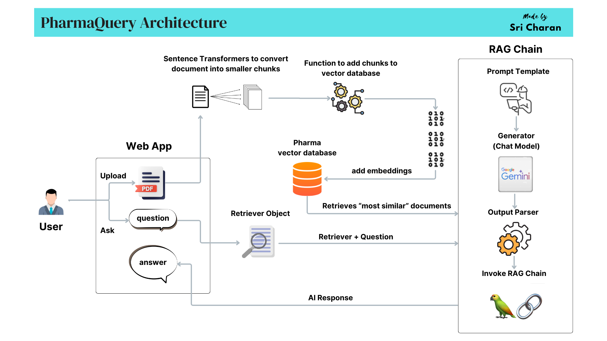

# PharmaQuery

## Overview
PharmaQuery is an advanced Pharmaceutical Insight Retrieval System designed to help users gain meaningful insights from research papers and documents in the pharmaceutical domain.

## PharmaQuery Architecture


## Features
- **Natural Language Querying**: Ask complex questions about the pharmaceutical industry and get concise, accurate answers.
- **Custom Database**: Upload your own research documents to enhance the retrieval system's knowledge base.
- **Similarity Search**: Retrieves the most relevant documents for your query using AI embeddings.
- **Streamlit Interface**: User-friendly interface for queries and document uploads.

## Technologies Used
- **Programming Language**: [Python 3.10+](https://www.python.org/downloads/release/python-31011/)
- **Framework**: [LangChain](https://www.langchain.com/)
- **Database**: [ChromaDB](https://www.trychroma.com/)
- **Models**:
  - Embeddings: [Google Gemini API (embedding-001)](https://ai.google.dev/gemini-api/docs/embeddings)
  - Chat: [Google Gemini API (gemini-1.5-pro)](https://ai.google.dev/gemini-api/docs/models/gemini#gemini-1.5-pro)
- **PDF Processing**: [PyPDFLoader](https://python.langchain.com/docs/integrations/document_loaders/pypdfloader/)
- **Document Splitter**: [SentenceTransformersTokenTextSplitter](https://python.langchain.com/api_reference/text_splitters/sentence_transformers/langchain_text_splitters.sentence_transformers.SentenceTransformersTokenTextSplitter.html)

## Requirements
1. **Clone the Repository**:
   ```bash
   git clone https://github.com/CodeWithCharan/PharmaQuery.git
   cd PharmaQuery
   ```

2. **Install Dependencies**:
   ```bash
   pip install -r requirements.txt
   ```

3. **Set Up Environment Variables**:
   Create a `.env` file in the project root directory with the following variables:

    ```bash
    GOOGLE_API_KEY="your_google_gemini_api_key"
    ```

    `Note:` Replace `your_google_gemini_api_key` with actual key.

4. **Run the Application**:
   ```bash
   streamlit run app.py
   ```

5. **Use the Application**:
   - Enter your query in the main interface.
   - Optionally, upload research papers in the sidebar to enhance the database.